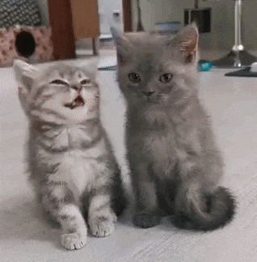
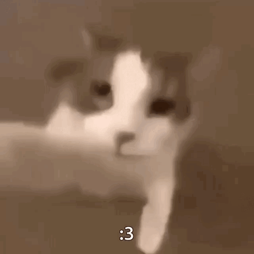

<html lang="en">
<head>
    <meta charset="UTF-8">
    <meta name="viewport" content="width=, initial-scale=1.0">
    <link rel="stylesheet" href="mum.css">
</head>
<body>
    
Мам я очнь тебя люблю спасибо тебе за все что ты сделала для меня
         я очень ценю все что ты делаешь для меня.Я не коогда не забуду все что ты для меня сделала и буду тебе все доверять.Люблю тебя мама.
    

    

     
    

    
Пап я тебя очень люблю.Ты самый лучший ты делаешь все для меня.Многие мне говорили что у них каките проблемы,а у меня все отлично
        спасибо тебе
    

    
    
Мама,папа я вас очень люблю спасибо вам за такое детство иногда я могу быть недовольным но знаете, что я вас очень люблю.

    <h3>Написал сайт ваш любимый сын Егор Панфилов</h3>
</body>
</html>
